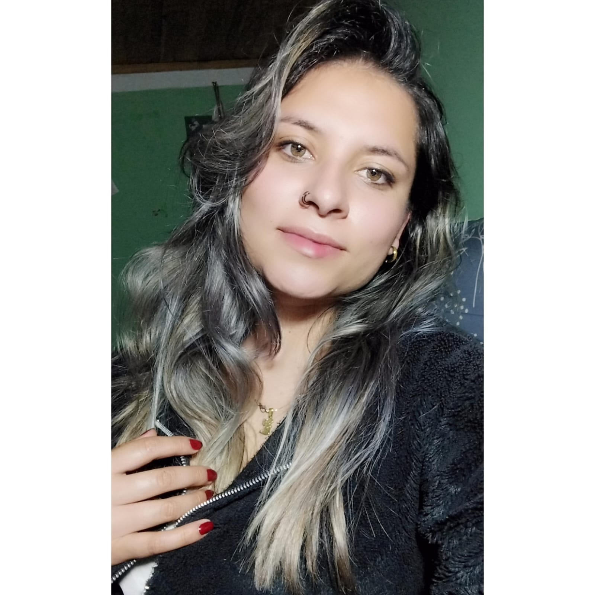

# VIDEOJUEGO-PV-

## Carlos Basallo

**Industry Role:** System Designer / QA Game Tester  
**Location:** Funza, Cundinamarca, Colombia

### Profile
I am a Multimedia Engineering student, passionate about video games and technology. I am motivated to learn about every stage of the process, from development to the design of games that have impacted the world.
____
# Equipo 16

---

## Diter Rico

Role: Leadership, Programamer, Designer  
Place: Soacha, Cundinamarca, Colombia.  
Profile: Multimedia Engineering student interested in the world of design, audiovisual production, animation and programming.

---

# Camilo Morales

**Rol:** Programmer / Animator / Audio Design
**Place:** Bogotá, Colombia
**Profile:** Multimedia producer with experience in the creative conceptualization through the technical execution of projects in areas such as:
- Graphic design 
- Audiovisual producer  
- Game development

## 👩‍💻 Leidy Dionicio

**Role in the Industry:** Video Game Designer  
**Location:** Bojacá, Cundinamarca, Colombia  

**Profile:**  
I am a student interested in video game development, with a strong affinity for visual design and animation. I am motivated to learn about game engines and collaborative work.

